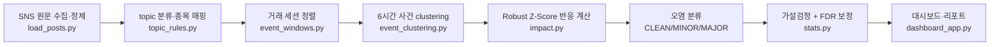

# 📈 Who Moves the Market?

### 누가 시장을 움직이는가? : 트럼프·일론 머스크 SNS 게시물 기반 주가 반응 분석
> 도널드 트럼프와 일론 머스크의 SNS 게시물(Truth Social/X)과 실제 금융시장 데이터를 같은 시간축 위에 올려놓고, 어떤 게시물 직후에 가격·거래량·변동성이 평소보다 이례적으로 반응했는지를 통계적으로 검증하는 프로젝트입니다. 미래 주가를 예측하지 않고, "이미 일어난 반응이 우연이 아니라고 방어할 수 있는가"를 목표로 합니다.

## Demo

[](https://youtu.be/0LQo-9-9-8Y)

🎥 **시연 영상**: [youtu.be/0LQo-9-9-8Y](https://youtu.be/0LQo-9-9-8Y) — 위 썸네일을 클릭하면 재생됩니다.

로그인이나 API 키 입력 없이 대시보드 자체는 바로 둘러볼 수 있습니다. AI 요약·번역만 선택적으로 키가 필요합니다(Quick Start 참고).

---

## Overview

본 프로젝트는 Trump·Musk의 SNS 게시물(Truth Social/X)과 TSLA·QQQ·SPY 등 종목·지수의 일봉 가격 데이터를 결합해, **robust z-score 기반 이벤트 스터디**로 "게시물 직후 시장이 이례적으로 반응했는가"를 검증합니다.

Track1(2023-01~2025-04, 통계적 가설검정)과 Track2(2025-06 결별·2025-10 관세 등 Kaggle 원본 범위 밖 개별 사건 케이스 스터디)를 이원 구조로 병행합니다. Track2는 사람이 고른 대표 사건뿐 아니라, Google News RSS 기반 **자동 뉴스 수집·클러스터링 파이프라인**으로도 확장됩니다. placebo 순열검정·FDR 다중검정 보정·ticker 교란 통제 보조검정까지 코드 레벨에서 방법론을 스스로 검증하도록 설계했고, 검증 과정에서 발견한 핵심 버그(SPY 자기 자신을 시장 벤치마크로 쓴 오류, topic 키워드 단어 경계 누락)를 직접 고치고 그 전후 결과를 투명하게 공개하는 것도 이 프로젝트의 일부입니다.

## Key Features

- Trump(Truth Social)·Musk(X) SNS 게시물 12만 건+ 정제 및 topic 룰베이스 분류
- Robust z-score(median/MAD) 기반 이벤트 스터디, 2-pass baseline(CLEAN 이벤트 날짜 제외)
- 다중게시·매크로(FOMC)·시장충격 3중 오염 분류 → CLEAN 표본만 정식 가설검정
- 같은 화자·ticker·topic·반응 거래일의 연속 게시물을 첫 글 기준 6시간 고정 창으로 묶어 pseudo-replication 방지(`event_clustering.py`)
- H1~H6 가설검정(Wilcoxon/Kruskal-Wallis/Mann-Whitney/Spearman) + Benjamini-Hochberg FDR 보정
- Placebo 순열검정(200회) + RIVN peer 민감도 분석으로 방법론 자체 검증
- ticker 교란 통제 보조검정 + η² 효과크기 분해로 "진짜 원인" 재검증
- topic 분류 정확도 직접 라벨링·평가(`scripts/track1/audit_topics.py`) — 키워드 룰 기반 분류의 한계를 수치로 공개
- **Track2 뉴스 자동 수집 파이프라인**: Google News RSS로 기사를 대량 수집하고(`scripts/track2/collect_track2_news.py`) 사건 단위로 클러스터링(`scripts/track2/build_track2_news_events.py`)해 SNS 원본 범위 밖 사건까지 자동으로 확장
- Track2 케이스 스터디: 로컬 LLM(Ollama+Qwen2.5:7b)으로 사실 기반 내러티브 생성 + 사람 검수 레이어
- **Streamlit 대시보드**(`시장 반응 / 사건 찾기 / 데이터 질문` 3메뉴): 반응강도 게이지, 머스크·트럼프 캐릭터, 감성 표시, 사건 검색, 데이터 질문. 사용자가 전체 데이터 범위 안에서 분석 기간을 직접 선택
- **Gemini 3.6 Flash** 등 AI 연결: 공식 `google-genai` SDK 기반 원문 번역·사건 요약·데이터 질문 + 실제 호출로 확인하는 연결 테스트(키 입력 ≠ 연결 성공을 구분해서 표시)
- 실시간 게시물 필터(`live_monitor.py`) — 가격 예측이 아닌 규칙 기반 관심 알림. Trump 최신 게시물은 비공식 Truth Social 미러 RSS + Jina Reader로 조회(별도 API 키 불필요)
- UTC 원본 시각 보존 → 미국 동부시간(ET) 변환 → 장 마감 후/휴장일은 다음 실제 거래일로 정렬
- 원본 게시물 ID·URL을 최종 이벤트까지 보존해 대시보드에서 원문으로 바로 이동

## Tech Stack

#### Language

<p>
  
</p>

---

#### Data Processing & Analysis

<p>
  
  
  
  
</p>

---

#### Machine Learning & NLP

<p>
  
  
  
  
  
  
</p>

---

#### Market & News Data

<p>
  
  
  
  
  
</p>

---

#### Visualization & Dashboard

<p>
  
  
  
</p>

---

## Quick Start

### 1. 설치

```bash
python3 -m venv .venv
source .venv/bin/activate
pip install -r requirements.txt
pip install -r requirements-optional.txt     # 감성분석(Twitter-RoBERTa) 등
pip install -r requirements-dashboard.txt    # Streamlit 대시보드 + Gemini(google-genai)
```

Kaggle에서 받은 게시물 CSV를 `data/raw/`에 넣어주세요(파일명에 `musk`/`elon`/`trump`/`donald`가 포함되면 자동 인식). `data/raw`·`data/interim`·`data/processed`는 `.gitignore`로 제외돼 있어 clone 직후엔 비어 있는 게 정상입니다 — 아래 순서대로 로컬에서 생성합니다.

### 2. 파이프라인 실행

```bash
# 옵션 없이 최소 실행
.venv/bin/python run_daily_pipeline.py

# 선택 기능까지 전부 포함
PYTHONPATH=. .venv/bin/python run_daily_pipeline.py \
  --add-sentiment --add-novelty --run-placebo --run-rivn-sensitivity \
  --build-narratives --llm-provider ollama --llm-model qwen2.5:7b
```

### 3. 대시보드 실행

```bash
PYTHONPATH=. .venv/bin/streamlit run dashboard_app.py
```

macOS/Linux는 `bash run_streamlit.sh`, Windows는 `run_streamlit.bat`을 더블클릭해도 됩니다(전용 가상환경·패키지를 자동 확인/설치). 화면은 `시장 반응 / 사건 찾기 / 데이터 질문` 3개 메뉴로 구성되며, AI 연결은 화면 오른쪽 위 `AI 설정`에서 Gemini/Groq/Ollama 중 선택합니다. API key가 없어도 가격 차트·필터·집계·기본 사건 요약은 그대로 동작합니다.

```bash
export GEMINI_API_KEY="..."   # 또는 GROQ_API_KEY, 또는 로컬 ollama serve
```

화면 사용법 전체는 [`docs/STREAMLIT_UPGRADE_KO.md`](docs/STREAMLIT_UPGRADE_KO.md)를 참고하세요.

### 4. (선택) Track2 뉴스 자동 수집

SNS 원본 범위(~2025-04-13) 밖의 사건을 Google News RSS로 자동 확장합니다.

```bash
# 한 달치 샘플로 먼저 확인
.venv/bin/python scripts/track2/collect_track2_news.py --start 2025-06-01 --end 2025-06-30 --source google --window-days 15
.venv/bin/python scripts/track2/build_track2_news_events.py

# 문제 없으면 전체 기간 수집 + 반영
.venv/bin/python scripts/track2/collect_track2_news.py --start 2023-01-03 --end 2025-10-23 --source google --window-days 15
.venv/bin/python scripts/track2/build_track2_news_events.py
.venv/bin/python scripts/track2/ensure_news_price_range.py
.venv/bin/python scripts/track2/refresh_track2_news.py
```

Windows에서는 `scripts/track2/run_news_sample.bat` → `scripts/track2/run_news_full.bat` → `scripts/track2/run_refresh_news_only.bat` 순서로 동일하게 동작합니다. 자세한 내용은 [`docs/NEWS_UPDATE_GUIDE_KO.txt`](docs/NEWS_UPDATE_GUIDE_KO.txt)를 참고하세요.

**감성분석 / novelty / placebo / RIVN 민감도 / Track2 LLM 내러티브 / twscrape 백필 / 장중 케이스 / 실시간 모니터링**처럼 자주 쓰지 않는 옵션은 [`docs/ADVANCED_USAGE.md`](docs/ADVANCED_USAGE.md)에 따로 정리했습니다.

## How It Works (Pipeline)



1. `load_posts.py`: 서로 다른 Musk/Trump CSV 스키마를 공통 형식으로 바꾸고 원본 ID·URL·UTC/ET 시각을 보존합니다.
2. `preprocess.py` + `topic_rules.py`: 분석 기간과 시장 관련 키워드를 적용하고 topic·연결 ticker를 정합니다.
3. `event_windows.py`: ET 기준 09:30 이전은 당일, 09:30~16:00은 당일(부분 일봉 경고), 16:00 이후·주말·휴장일은 다음 거래일에 연결합니다.
4. `event_clustering.py`: 같은 화자·ticker·topic·반응 거래일의 글을 첫 게시물 기준 6시간 고정 창으로 묶고 모든 원문·URL을 보존합니다.
5. `impact.py` + `contamination.py`: 사건별 가격 반응 점수와 별도 사건/FOMC/시장충격 중첩 여부를 계산합니다.
6. `stats.py`: CLEAN 사건 표본으로 가설검정과 FDR 보정을 수행합니다.
7. `plots.py` + `report.py` + `dashboard_app.py`: 차트·HTML 리포트·클릭 가능한 Streamlit 화면을 만듭니다.

**Track2 뉴스 자동 파이프라인**(SNS 원본 범위 밖 사건 확장)은 별도 흐름으로 동작합니다:

```
scripts/track2/collect_track2_news.py (Google News RSS 기사 수집)
  → scripts/track2/build_track2_news_events.py (기사 → 뉴스 사건 클러스터링)
  → scripts/track2/ensure_news_price_range.py (필요 시 가격 데이터 기간 보정)
  → scripts/track2/refresh_track2_news.py (SNS 결과는 유지한 채 뉴스 사건만 대시보드 데이터에 반영)
```

세부 파일 역할과 고도화 순서는 [`docs/PROJECT_GUIDE_KO.md`](docs/PROJECT_GUIDE_KO.md)를 참고하세요.

<details>
<summary>시간 정렬 · 사건 clustering 원칙 자세히 보기</summary>

### 시간 정렬 원칙

| ET 게시 시점 | 일봉 이벤트 거래일 | 해석 품질 |
| --- | --- | --- |
| 거래일 09:30 이전 | 같은 거래일 | 장 시작 후 반응을 대체로 포함 |
| 거래일 09:30~16:00 | 같은 거래일 | 게시 전 당일 움직임이 섞여 분봉 분석 권장 |
| 거래일 16:00 이후 | 다음 거래일 | 다음 정규장 반응에 연결 |
| 주말·휴장일 | 다음 거래일 | 다음 정규장 반응에 연결 |

`posted_at`은 기존 코드 호환용 timezone-naive UTC이며, 의미가 명확한 `posted_at_utc`, `posted_at_et`, `market_session`, `event_date_rule`, `daily_alignment_quality`를 함께 저장합니다. 미국 조기폐장일은 현재 16:00 마감을 사용하므로 후속 버전에서 거래소 캘린더 기반으로 보완할 예정입니다.

### 사건 clustering 원칙

일봉 하나에 같은 캠페인의 게시물 여러 개가 연결되면 같은 가격 반응을 여러 번 세는 문제가 생깁니다. 기본 분석은 `person + ticker + topic + event_date`가 같고 첫 게시물로부터 6시간 이내인 글을 하나의 사건으로 묶습니다. 직전 글과의 간격이 아니라 첫 글을 기준으로 잡아 cluster가 연쇄적으로 며칠까지 늘어나는 것을 막습니다. `--no-cluster-posts`로 기존 게시물 단위 결과를 재현하거나 `--cluster-hours`로 민감도를 비교할 수 있습니다.

</details>

## Key Metrics

불투명한 단일 점수 대신, 아래 세 계산을 그대로 노출합니다.

**초과수익률(abnormal_return)**

```text
종목 수익률 - 시장/peer 평균 수익률
  · TSLA는 GM·F·RIVN peer 평균 대비
  · QQQ/SPY는 서로를 시장 프록시로, SPY는 자기 자신이면 벤치마크 차감 없이 원 수익률 사용
```

**Robust Z-Score (median/MAD 기반)**

```text
z = (오늘 값 - 최근 60거래일 중앙값) / (최근 60거래일 MAD × 1.4826)
  · 평균/표준편차 대신 중앙값/MAD를 써서 극단치 하나에 스케일이 안 흔들림
  · "최근 60일"을 매일 다시 계산 → 시기가 지나도 baseline이 그때그때 갱신됨
```

**반응 강도 점수(impact_score)**

```text
impact_score = |z_초과수익률| + max(z_거래량, 0) + max(z_변동성, 0)
```

세 값을 왜 이렇게 계산하게 됐는지(원본 EDA에서 발견한 극단치·결측 문제, robust z-score를 선택한 이유)는 실제 데이터로 검증한 시각 자료를 따로 만들어뒀습니다.

## Data Scope

```text
원본 게시물 127,246건 (Trump 90,343 + Musk 36,903)
  → market-relevant 필터링 3,015건 (topic 키워드 매칭)
  → 6시간 사건 clustering 2,173건 (pseudo-replication 방지)
  → CLEAN(오염 없음) 359건 (다중게시·FOMC·시장충격 제외, 정식 가설검정 표본)

Track2(SNS 원본 범위 밖) 사건 6건 — 2025-06 결별, 2025-10 관세 발표 등
```

| 구분 | 범위 |
| --- | --- |
| 인물 | Donald Trump(Truth Social/X), Elon Musk(X) |
| 종목·지수 | TSLA, QQQ, SPY (peer 비교용 GM, F, RIVN 포함) |
| Track1 분석 기간 | 2023-01-01 ~ 2025-04-13 |
| Track2 확장 기간 | ~2025-10-23 (Google News RSS 자동 수집) |
| 가격 데이터 | yfinance 일봉(OHLCV), 이벤트 전후 D-N~D+N 조회 가능 |

## Key Findings

아래 표는 시간대·clustering 수정 전 게시물 단위 CLEAN 표본(359건)에서 나온 역사적 baseline입니다.

| 가설 | 내용 | 최종 판정 |
| --- | --- | --- |
| H1 | 게시 전후 변동성 증가 | ❌ 기각 |
| H2 | topic별 반응 차이 | ❌ 기각(ticker 교란으로 재해석) |
| H3 | 직결/비직결 기업 반응 차이 | ❌ 기각(ticker 교란으로 재해석, 문제의식은 유지) |
| H4 | 감성(긍정/부정) 비대칭 | ❌ 기각(raw p<0.05, FDR 보정 후 비유의) |
| H5 | 단기 집중·소멸 | ⏸ 판단 보류(일봉 해상도 한계) |
| H6 | 정치 권력 확정 여부 | ❌ 기각(대통령 시기 표본 n=8로 검정력 부족) |

**Main Findings**

- ticker(TSLA/QQQ/SPY) 하나가 절대 초과수익률 분산의 27.2%를 설명 — topic이 추가로 설명하는 몫은 **0.3%p**뿐
- SPY를 SPY 자기 자신과 비교하던 벤치마크 버그를 발견·수정 — 이후 통계 결과가 훨씬 보수적인 방향으로 수렴
- topic 키워드가 단어 경계 없이 매칭되던 버그 발견(`ai`가 "said" 안에서 88% 오탐) — 수정 후 market-relevant 게시물 6,185건 → 3,015건으로 절반 가까이 감소, 오히려 CLEAN 표본은 268→359건으로 증가
- 자체 topic 분류 정확도를 직접 라벨링해 검증 — 전체 정확도 56%, Musk 쪽 topic(precision 100%) vs Trump 쪽 topic(precision 0~40%대)의 격차를 수치로 공개
- 다중게시를 "신호"로 볼지 "오염"으로 볼지 두 관점을 직접 실험 — 신호 관점은 pseudo-replication(같은 날짜 관측치 최대 42회 중복)으로 허위 유의성을 양산함을 확인
- Track2 케이스 스터디에서 2025-10-10 관세 발표가 확장 기간 전체 최대 반응(SPY z=-5.49)으로 확인됨

방법론 검증 과정과 재해석의 전체 기록은 [`docs/implementation_status.md`](docs/implementation_status.md)에서 확인할 수 있습니다.

## Current Limitations

- 발언과 시장 반응의 시간적 연관성은 인과관계 증명이 아닙니다 — CLEAN 분류는 "다른 요인과 안 섞였다"는 뜻이지 "이 발언 때문"이라는 뜻이 아닙니다.
- 일봉 해상도 기반이라 장중 정밀 타이밍 분석(H5)은 판단을 보류했습니다. 분봉 케이스 스터디는 `scripts/track2/run_intraday_case_study.py`로 선택 실행할 수 있습니다.
- 미국 조기폐장일은 현재 16:00 마감 기준을 그대로 적용합니다(거래소 캘린더 미반영).
- Musk는 무료로 안정적인 실시간 X 소스가 없어 대시보드 실시간 조회 대상에서 제외했습니다.
- Track2 뉴스 자동 수집은 Google News 검색 인덱스 기반이라 "전 세계 모든 기사 완전 수집"을 보장하지 않습니다.
- 대통령 시기 표본(H6, n=8)처럼 특정 그룹 표본이 작아 검정력이 부족한 가설은 있는 그대로 "판단 보류"로 남겨뒀습니다.
- topic 분류는 키워드 룰 기반이며 정확도는 56%(Trump 쪽이 특히 낮음)로 직접 라벨링해 공개했습니다 — 새 topic이나 표현이 늘면 재검증이 필요합니다.

## Project Structure

```bash
.
├── market_mover/                  # 핵심 로직 패키지
│   ├── config.py                  # 경로·기간·티커 등 전역 설정
│   ├── load_posts.py              # SNS 게시물 로딩·정제
│   ├── load_prices.py             # yfinance 가격 다운로드 + 캐시 폴백
│   ├── preprocess.py              # market-relevant 필터링
│   ├── topic_rules.py             # 키워드 기반 topic 분류·종목 매핑
│   ├── event_windows.py           # 이벤트 정렬(Track1/Track2)
│   ├── event_clustering.py        # 연속 게시물 6시간 사건 clustering
│   ├── impact.py                  # robust z-score, impact_score
│   ├── contamination.py           # 오염 분류(CLEAN/MINOR/MAJOR)
│   ├── novelty.py / sentiment.py  # novelty score / 감성분석(선택)
│   ├── stats.py                   # H1~H6 통계검정 + FDR 보정
│   ├── placebo.py / sensitivity.py# 순열검정 / RIVN 민감도
│   ├── case_narratives.py         # Track2 LLM 내러티브·번역·데이터 질문(Gemini/Groq/Ollama)
│   ├── plots.py / report.py       # Plotly 차트 / HTML 리포트
│   └── dashboard_data.py / dashboard_widgets.py  # 대시보드 로더·게이지
├── run_daily_pipeline.py          # 메인 실행 파일(Track1 이벤트 스터디)
├── dashboard_app.py               # Streamlit 대시보드(시장 반응 / 사건 찾기 / 데이터 질문)
├── live_monitor.py                # 실시간 게시물 필터
├── run_streamlit.sh / .bat        # 대시보드 실행 스크립트(macOS·Linux / Windows)
├── scripts/
│   ├── track1/
│   │   └── audit_topics.py             # topic 분류 정확도 검증
│   └── track2/                         # Track2(SNS 원본 범위 밖) 전용 도구 + Windows 런처
│       ├── find_track2_news_candidates.py    # 뉴스 후보 탐색(수동 큐레이션용)
│       ├── collect_track2_news.py            # 뉴스 대량 수집(Google News RSS)
│       ├── build_track2_news_events.py       # 수집된 기사를 뉴스 사건 단위로 클러스터링
│       ├── ensure_news_price_range.py        # 뉴스 사건 기간까지 가격 데이터 범위 보정
│       ├── refresh_track2_news.py            # SNS 결과 유지한 채 뉴스 사건만 갱신
│       ├── backfill_track2_musk_twscrape.py  # Musk 게시물 보조 수집(선택)
│       ├── run_intraday_case_study.py        # 분봉 케이스 스터디
│       └── run_news_*.bat / run_fix_news_dates.bat  # 위 스크립트들의 Windows 런처
├── docs/                          # 가이드·검증·진행 기록 문서 (아래 Documentation 참고)
├── data/
│   ├── raw/                       # 원본 CSV (직접 채워야 함, git에는 미포함)
│   ├── manual/                    # Track2 수동 이벤트, FOMC 캘린더 등
│   └── interim/ processed/        # 파이프라인 중간·최종 산출물(git에는 미포함)
├── outputs/{tables,figures,reports}/  # 통계·차트·리포트 산출물
├── requirements.txt / requirements-optional.txt / requirements-dashboard.txt
└── README.md
```

## Documentation

| 문서 | 내용 |
| --- | --- |
| [`docs/PROJECT_GUIDE_KO.md`](docs/PROJECT_GUIDE_KO.md) | 코드 구조·핵심 모듈 책임·고도화 로드맵 |
| [`docs/implementation_status.md`](docs/implementation_status.md) | 실행·발견·수정 기록(살아있는 상태 문서) — 방법론 재검증의 전체 과정 |
| [`docs/STREAMLIT_UPGRADE_KO.md`](docs/STREAMLIT_UPGRADE_KO.md) | 대시보드 화면 사용 안내(3메뉴 구조, AI 요약·번역) |
| [`docs/NEWS_UPDATE_GUIDE_KO.txt`](docs/NEWS_UPDATE_GUIDE_KO.txt) | Track2 뉴스 자동 수집 파이프라인 사용 순서 |
| [`docs/GEMINI_UPDATE_GUIDE_KO.txt`](docs/GEMINI_UPDATE_GUIDE_KO.txt) | Gemini 3.6 연결·연결 테스트 상태 표시 안내 |
| [`docs/ADVANCED_USAGE.md`](docs/ADVANCED_USAGE.md) | 감성분석/novelty/placebo/RIVN/Track2 백필/장중 케이스 등 선택 옵션 실행법 |
| [`docs/TIME_ALIGNMENT_VALIDATION.md`](docs/TIME_ALIGNMENT_VALIDATION.md) | UTC→ET 시간 정렬 검증 리포트 |
| [`docs/CLUSTERING_VALIDATION.md`](docs/CLUSTERING_VALIDATION.md) | 6시간 사건 clustering 기준 검증 리포트 |
| [`docs/BASELINE_RESULTS_2_REVIEW.md`](docs/BASELINE_RESULTS_2_REVIEW.md) | 시간대 수정 전후 가설검정 결과 비교 |

## Review Checklist

- [x] 실제 SNS 원문과 출처(원본 게시물 ID·URL) 보존
- [x] 실제 시장 종가·거래량(yfinance) 기반 반응 계산
- [x] robust z-score(median/MAD) + 2-pass baseline
- [x] 다중게시·매크로(FOMC)·시장충격 오염 분류 → CLEAN 표본만 정식 검정
- [x] Placebo 순열검정(200회) + FDR 다중비교 보정
- [x] ticker 교란 통제 보조검정으로 원 결과 재해석
- [x] topic 분류 정확도 직접 라벨링·공개(56%)
- [x] SNS 사건 + 뉴스 자동 수집(Track2) 이원 구조
- [x] 원문·번역·AI 요약과 계산 결과(pandas) 분리 — AI 연결 없이도 핵심 기능 동작
- [x] 발견한 버그(SPY 자기 벤치마크, topic 키워드 경계) 전후 결과 투명 공개
- [x] 한계·판단 보류 항목 명시(H5, H6, topic 정확도 등)

## Conclusion

이벤트 스터디 인프라(정렬·오염 분류·robust z-score)와 placebo 기반 방법론은 견고하게 작동했습니다. 다만 원래 유의했던 topic(H2)·인물(H3) 효과는 재검증 결과 종목(ticker) 자체의 변동성 차이로 설명되는 교란이었고, 이는 "SNS 발언 내용 자체"보다 "그 발언이 어떤 종목에 연결되는가"가 시장 반응 크기를 결정하는 더 근본적인 요인일 수 있음을 시사합니다.

이 결과가 "SNS 데이터가 시장과 무관하다"는 뜻은 아닙니다 — CLEAN 이벤트 정의 자체가 게시물 직후의 이례적 반응이라는 시간적 연관 위에 서 있고, Track2 케이스 스터디(2025-06 결별, 2025-10 관세 발표)는 그 극단적 사례를 구체적으로 보여줍니다. 부정된 것은 "그 반응의 크기가 발언 내용·화자에 따라 체계적으로 달라진다"는 더 좁고 구체적인 주장이며, 이 프로젝트는 그 주장을 검증하는 과정에서 스스로 두 개의 핵심 버그(벤치마크 오류, 키워드 매칭 오류)를 찾아 고쳤다는 점에서 방법론 검증 장치가 의도대로 작동했다고 판단합니다.

## Notice

본 프로젝트는 투자 조언이 아닙니다. 여기서 다루는 상관관계는 인과관계를 의미하지 않으며, 실제 투자 판단에 사용해서는 안 됩니다.
